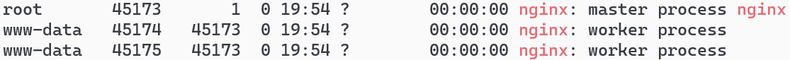
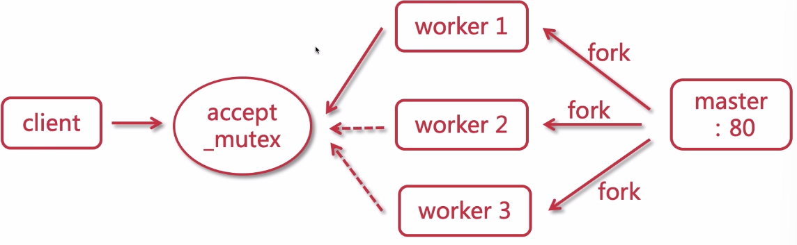

# 集群

单体架构的问题

- 单节点宕机导致所有服务不可用
- 耦合度太高（迭代，测试，部署）
- 单节点并发能力有限

集群

- 群体构成整个系统
- 这个群体构成一个整体，不能独立存在
- 集群提高并发和可用性

优势

- 提高系统性能
- 提高系统可用性
- 可扩展性高

注意点

- 用户会话 - 分布式会话
- 定时任务 -  定时任务的服务器， 或者延时任务
- 内网互通


## Nginx

主要功能

- 反向代理
- 通过配置文件 实现集群和负载均衡
- 静态资源虚拟化

### 代理

- 正向代理

  客户端请求目标服务器之间的一个代理服务器，请求先经过代理服务器，然后再转发请求给目标服务i去，获得内容后最后相应给客户端

  客户端 <-> 正向代理 <-> 目标服务器

- 反向代理

  用户请求目标服务器，由代理服务器决定

  

  localhost:8080/fafoodshop 								Tomcat1

  localhost:8080/fafoodcenter		-> nginx		 Tomcat2

  localhost:8080/image											静态资源

### 进程模型

master：主进程

worker：副进程



### 抢占机制



事件处理，epoll模型

###  配置

main					全局配置

- event			配置工作模式以及连接数

- http               http模块相关配置
  - server
    - location 路由规则，表达式
    
      location的匹配规则：
    
      
    
    - upstream 集群 内网服务器

http

- sendfile: 提高传输文件效率

- tcp_nopush：累积到一定才会发送数据包

- gzip：压缩文件，降低网络压力

  gzip on 																	# 开启gzip压缩功能，提高传输效率 节约带宽

  gzip_min_length 1;												 # 限制最小压缩的文件大小

  gzip_comp_level 3;												 # 定义压缩级别压缩比例文件越大压缩越多但是cpu使用越多

  gzip_types text/plain application/javascript;	  # 定义压缩文件类型

expires: 缓存过期时间设置

- expires [time]
- expires @[time] @22h30m
- expires -[time]
- expires epoch
- expires off    关闭资源过期
- expires max 过期时间最大

反向代理缓存 **在server节点外配置**

proxy_cache_path 设置缓存目录\

key_zone 设置共享内存以及占用的空间大小

max_size 设置缓存大小

inactive 超过此时间,则自动清理缓存

use_temp_path 关闭临时目录

```shell
http{
	proxy_cache_path /usr/local/nginx/upstream_cache
	keys_zone=mycache:5m
	max_size=1g
	inactive=30s
	use_temp_path=off
	
	server {
		listen 80;
		servername www.tomcats.com;
		# 开启并且使用缓存
		proxy_cache mycache;
		# 针对200和304状态码缓存时间为8小时
		proxy_cache_valid 200 304 8h;
		location /static {
			# 使用别名方式
			alias		/home/static;
			proxy_pass http://tomcats;
		}
	}
}
```


### 常用命令

nginx -s stop 暴力关闭nginx 类似kill -s 9 nginxPID

nginx -s quit 运行直到最后一个用户退出

nginx -c 指定配置文件 set configuration file

### 负载均衡

四层负载均衡:基于转发

- F5 硬负载均衡，基于硬件，企业级别
- **LVS**: 四层负载均衡,主要用这个 基于Linux内核
- Haproxy: 四层负载
- Nginx: 四层负载均衡

七层负载均衡: 基于引用转发

- **Nginx**: 主要用这个
- Haproxy
- Apache

JMeter测试: 

#### 策略

轮询: 默认负载均衡策略是轮询

加权轮询:每个有权重 

ip_hash: 根据iphash去分配到特定的服务器处理. 

​	如果要将一个服务器移除集群

​	hash算法带来的问题: hash不一致

​	一致性hash算法 针对用户的特征 IP或者主机名

url_hash: 针对访问的路径 url进行hash 每个特定的url前缀 分配到特定的服务器

least_conn: 将新到的连接分配到当前连接数最少的服务器上面

```shell
upstream tomcats{
	server 192.168.0.1:8080 max_conns=2 weight=1;
	server 192.168.0.2:8080 max_conns=4 weight=2;
	server 192.168.0.3:8080 max_conns=9 weight=5;
}
# upstram下面的配置都是加在这后面
```

#### upstream

upstram: max_fails, fail_timeout, slow_start 只在集群中有用. 

max_conns: 最大的并发的连接数目 限流 (现在社区版本也可以使用), 如果接受数目达到上限 是 502 错误

down: 标志服务器永久不可用

max_fails: 最大失败次数 

slow_start: set the time during the server will recover its weight from zero to a nominal value, when unhealthy server becomes healthy, or whem the server becomes available after a period of time it was considered unavailable. default value is zero -> slow start is disabled. 不能再hash和随机负载均衡中使用.

backup: 标志的某一台sever是一台备用机 只有当其他服务器全die了之后,才会被启用

fail_timeout: 失败时间 默认10s

keepalive: 提高吞吐量 保持一部分连接为长连接. 避免一部分的损耗

### 利用Nginx配置HTTPS域名证书

这是利用源码安装所需的步骤

1. 安装SSL模块

   需要安装http_ssl_module

   - 进入到nginx的解压目录 

   - 新增ssl模块 (原来模块需要保留)

```shell
./configure \
--perfix=/usr/local/nginx \
--pid-path=/var/run/nginx/nginx.pad \
--lock-path=/var/lock/nginx.lock \
--error-log-path=/var/log.nginx/access.log \
--http-log-path=/var/log/nginx/access.log \
--with-http_gzip_static_module\
--http-client-body-temp-path=/var/temp/nginx/proxy \
--http-fastcgi-temp-path=/var/temp/nginx/fastcgi \
--http-uwsgi-temp-path=/var/temp/nginx/uwsgi \
--http-scgi-temp-path=/var/temp/nginx/scgi \
--with-http_ssl_module

make

make install
```

2. 配置HTTPS

   将ssl证书 *.crt和私钥 *.key 拷贝到 /usr/local/nginx/conf目录中

   新镇server监听443端口

   ```
   server{
   	listen 443;
   	server_name www.adsfasdfdsp.com;
   	# 开启ssl
   	ssl on;
   	# 配置ssl证书
   	ssl_certificate adsdfs.crt;
   	# ssl会话超时时间
   	ssl_certificate_key adsdfs.key;
   	
   	# 配置加密套件 写法遵循openssl标准
   	ssl_protocols TLSv1 TLSv1.1 TLSv1.2
   	ssl_ciphers ECDHE-RSA-AES127-GCM-SHA256:HIGH:!aNULL:!MD5:!RC4:!DHE;
   	ssl_prefer_server_ciphers on;
   	
   	location / {
   		# 由于在本地配置的网址映射 会跳转到自己配置的IP地址
   		proxy_pass http://tomcats/;
   	}
   }
   ```

#### 动静分离

- 分布式: 
- 前后端解耦: 
- 静态归属于nginx: 
- 接口服务化: 单独进行部署

静态数据: html页面 javascript脚本等 修改 -> cache刷新

动态数据: 接口形式的请求, 动态数据 得到的相应可能会和上次不一样

动静分离 CDN: 从当前离访问的IP地址根据配置去放回静态文件

### Nginx遇到的问题


