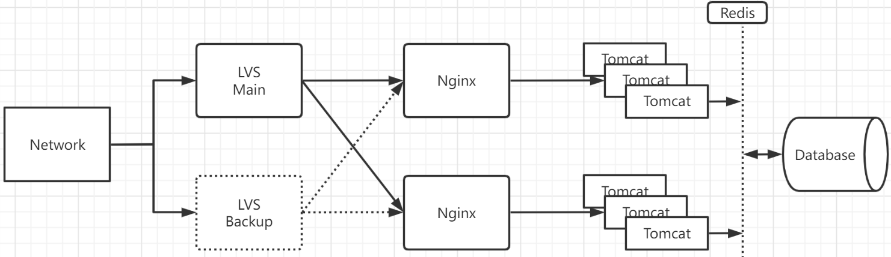
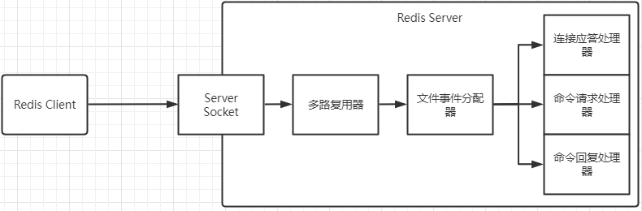

## 分布式构架

- 分布式系统设计对用户透明

- 可以发展为集群分布式系统构架

- 微服务是分布式的子集

缺点：

- 架构复杂
- 部署多个子系统复杂
- 子系统之间通信耗时
- 新人融入团队缓慢
- 调试复杂 测试环境 生产环境 排查问题麻烦

设计原则：

- 异步解耦：能使用异步就是用异步 异步需要使用到消息队列
- 幂等一致性：数据一致性 

## 现有架构的弊端




## NoSQL

Not Only SQL

- 传统项目可以使用关系型数据库
- NoSQL可以为数据量大的服务
- 水平扩展方便高效
- NoSQL主要是键值对的形式 添加和删除性能高
- 高性能读取
- 高可用 (redis 可以搭建集群)
- 存数据, 做缓存

**NoSQL 分类**

- 键值对数据库    Redis Memcache
- 列储存数据库    Hbase Cassandra
- 文档型数据库    MongoDB, CouchDB
- 图形数据库        Neo4J FlockDB

**分布式缓存**

- 提升读取数据速度
- 分布式计算领域
- 为数据库降低查询压力
- 跨服务器缓存
- 内存式缓存: 少量请求分到数据库, 当缓存满了可以选择

## Redis

什么是:

- NoSQL
- 分布式缓存中间件
- key-value 存储
- 提供海量数据存储访问
- 数据存储在内存里面
- 非关系 分布式 开源 水平扩展

### 缓存方案对比

**Ehcache**

- 基于java开发
- 基于JVM缓存
- 简单 轻巧 方便

缺点: 不支持集群 和 分布式

Memcache

- 简单的key-value存储 只支持字符串存储
- 内存使用率高
- 多核处理器 多线程

缺点: 无法容灾 数据无法持久化

Redis

- 丰富的数据结构
- 持久化
- 主从同步 故障转移
- 内存数据库

可能的缺点: 无法利用到全部的服务器的核心, 单线程

### 操作

flushall 删除所有db的所有key

ttl KEY 查看某个KEY的过期时间 -1 永不过期， -2 已经过期 被清理了

EXPIRE KEY TIME 设置某个KEY的过期时间TIME

set vip yes ex 20         mset msetnx mget 

incr KEY 为KEY的值增加1

INCRBY KEY STEP: 键KEY的值增加长度为STEP

DECRBY KEY STEP: 键KEY的值减小长度为STEP 

getrange name L-R ：获得键的值的从L到R的范围

### 数据类型

#### string

 string -> key:value

```java
user{
	name: string
	parents: string
}
```

上面这种有类型的数据结构可以使用hash去存储

#### hash

hset user name imooc

  hget user name  -> user.getname()

hmset user age 18 sex man  同时为一个hash表设置多个对应关系

HINCRBY / HINCRBYfloat

HEXISTS

HDEL NAME KEY

HGETALL NAME

#### LIST

**LPUSH LIST_NAME val1 val2 val3** 创建LIST_NAME的list 并且放入val

```
val3
val2
val1
```

**LRANGE LIST_NAME L  R** LIST_NAME的L到R

**rpush LIST_NAME val val** 创建LIST_NAME的list 并且放入val 和上面的方向相反

**LPOP LIST_NAME** 从左边pop出最左侧的一个

**RPOP LISTNAME** 从右边边pop出最左侧的一个

**llen LIST_NAME**

**LINDEX LIST_NAME index** 从左侧开始计数, 获取index的位置的元素

**LSET LIST_NAME index val** 将index位置的元素设置为val

**LINSERT LIST_NAME before beforeVAL val** 在beforeVAL前面插入val (同样的after)

**LREM key count value** 从key list移除count个value

**ltrim key left right** 将原key list的left 到 right替换原 key list

**del key** 删除list

#### SET

**sadd key val1** 创建key set 并且添加val1到数据里面去

**SMEMBERS key** 查看key下面的所有的key

**scard  key** 查看key set下面有多少个元素

**sismember key val** val在不在key set下面

**srem key val** 删除 key set下面的 val

**spop key num** 弹出num个的 val, num不加的话默认是1

**SRANDMEMBER key num** 随机获取num个member

**sadd key member 多个**

**smove source destination val** 将val 从s移到d

**sdiff a b** : a b set之间的差

 **sinter a b** : ab之间相同的2取出来

#### ZSET

**sorted set 有序的set 每一个member都具有一个分数 根据分数排名**

**zadd key [nx|xx] [ch] [incr] score member [score member ...]**

```shell
zadd zset 10 duck 20 pig 30 chichen 40 beef 50 sheep
```

**zrange key** 0 -1 

**zrank key val** 查询val的排名

**zcard key** 查询总的有多少

**zcount key l r** 查询l到r之间一共有多少个元素

### 线程模型

Redis线程模型



  